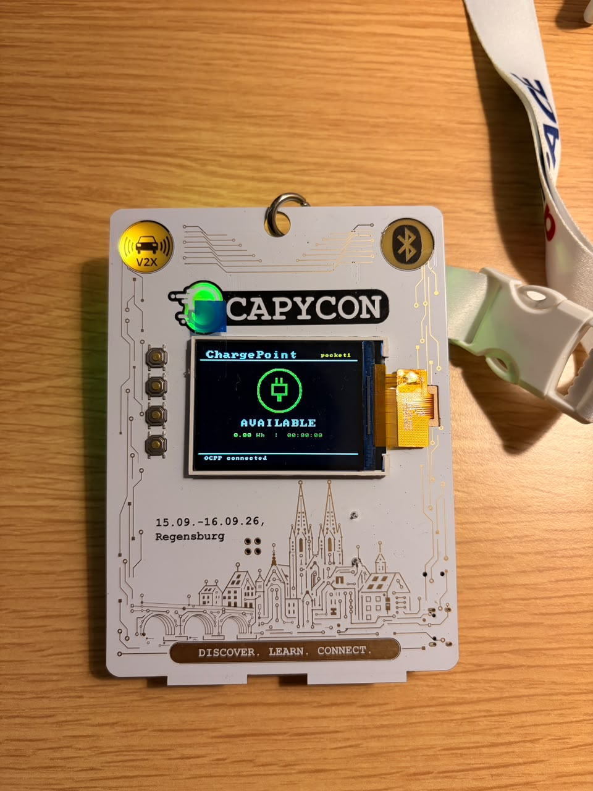

# ScapyCon26 EVSE Badge — Flash Kit

Pre-built factory firmware image and one-shot flashing script for the
**ScapyCon 2026** conference badge (ESP32-C5), running in **Pocket EVSE**
mode — an OCPP-speaking charge point simulator built into the badge.
ScapyCon 2026 runs 15.–16.09.2026 in Regensburg, Germany.



This is an extended build of the badge firmware with a dedicated
ChargePoint screen: it connects to Wi-Fi, speaks OCPP to a CSMS, and
shows live status on-device (state, e.g. `AVAILABLE`, energy in kWh,
session duration, and OCPP connection status). It also exposes BLE so
commands can be sent without a serial cable.

Firmware source lives at
[dissecto-GmbH/scapycon-2026-badge-firmware](https://github.com/dissecto-GmbH/scapycon-2026-badge-firmware).
This repo just packages a ready-to-flash binary + script so you don't
need to set up ESP-IDF to get a badge running.

> **Wi-Fi note:** `factory_flash.bin` ships with placeholder Wi-Fi
> credentials (`YOUR_WIFI_SSID` / `YOUR_WIFI_PASSWORD`), not any real
> network's password. You set your own Wi-Fi after flashing (see below).

## Requirements

- A ScapyCon 2026 badge (ESP32-C5)
- USB cable
- [`esptool`](https://github.com/espressif/esptool) (`pip install esptool`)

## Flashing

```bash
./flash.sh [PORT]      # default PORT: /dev/ttyACM0
```

1. Put the badge in download mode: hold **SW_BOOT**, then plug in USB
   (or hold **SW_BOOT** and tap **SW_RESET** if already plugged in).
2. Run `flash.sh`. It writes the whole `factory_flash.bin` image to
   offset `0x0` in a single write — this board has a dual-app-partition
   layout (`factory` + `ota_0`), and writing the main app to the wrong
   offset will brick it, so don't split this into per-partition writes.
3. Unplug and replug the badge (power cycle) to boot the new firmware.
   This chip's native USB-Serial/JTAG interface sometimes sits in the
   ROM download loader after a flash instead of booting cleanly — a
   physical power cycle reliably fixes this; software-only resets don't
   always.

## First-time setup (per badge)

The badge boots into EVSE mode via **SW_D**, but shows **"SETUP MODE"**
until it has both Wi-Fi and an OCPP identity. Configure it over UART
(115200 baud) while the badge is in Name mode — the same three commands
work over BLE if you'd rather not use a serial cable:

```
YourName
wifi:ssid,password
ocpp:ws://cms-server/cpId
```

- **Name** — sets the display name shown on the badge.
- **WIFI** (`wifi:ssid,password`) — joins the badge to a network.
- **OCPP Endpoint** (`ocpp:ws://cms-server/cpId`) — points the badge at
  your CSMS; the last path segment (`cpId`) is the charge point ID, and
  each badge needs its own so the CSMS can tell them apart.

## License

See the upstream firmware repo for licensing.
